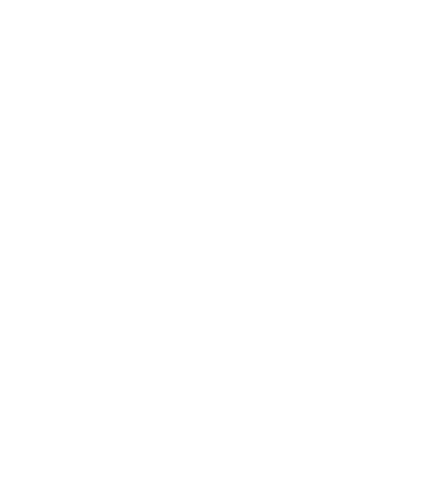

  
  <h1>OKAMI</h1>
  
<strong>Hobby developer, Linux tinkerer, worldbuilder, and curious creator.</strong>

  
<a href="https://shadowokami.com">Website</a> / <a href="https://www.youtube.com/@shadowokami04">YouTube</a> / <a href="https://www.twitch.tv/shadowokami_">Twitch</a> / <a href="mailto:service@shadowokami.de">Email</a>

---

## Personal ideas, made real

I'm Okami, a beginner hobby developer who likes turning personal ideas into useful tools, experiments, long-term projects, and worlds to explore. I usually create for my own setup or interests first, then share the results publicly when they become useful, interesting, or simply fun for others too.

I enjoy working at my own pace, trying new technologies, and shaping each project around how I would actually use, play, or explore it.

## Projects

| Project | What it is | Current state |
| --- | --- | --- |
| [**Voidline**](https://github.com/ShadowOkami4/Voidline_Showcase) | An experimental desktop experience and shell around Hyprland, planned across Quickshell, Python, Lua, and Rust. | The current repository is an **AI-generated showcase**. The real implementation is still in development. |
| **LunaEcho** | A Discord bot planned around moderation, tickets, music, leveling, temporary voice channels, and flexible self-hosted or managed access. | In development. A public GitHub repository is planned. |
| [**StreamNotifier**](https://github.com/ShadowOkami4/StreamNotifier) | A small utility for sending a Discord notification when a stream goes live. | Public and available to try. |
| [**MirrorGate**](https://github.com/ShadowOkami4/Mirrorgate) | An open-source D&D 5.5e world setting presented as an interconnected Obsidian vault, where broken time, folded roads, and dangerous reflections shape one shared realm. | Early development. Planned: 10 one-shots, 5 short adventures, 3 long-term campaign frameworks, plus subclasses, feats, magic items, monsters, and more. |

## Tools and interests I like exploring

`JavaScript` `Node.js` `Python` `Lua` `Rust` `Quickshell` `Hyprland` `Linux` `Discord` `Obsidian` `D&D 5.5e` `Worldbuilding`

These are tools and creative areas that currently appear in my projects and experiments, not a list of things I claim to have mastered.

## Videos and streams

My [YouTube channel](https://www.youtube.com/@shadowokami04) is a mix of gaming videos and project showcases, including feature previews, demos, and progress updates.

My [Twitch streams](https://www.twitch.tv/shadowokami_) are a separate hobby focused on gaming and relaxed streams, not coding projects.

---

  Built for fun. Shared with everyone.

